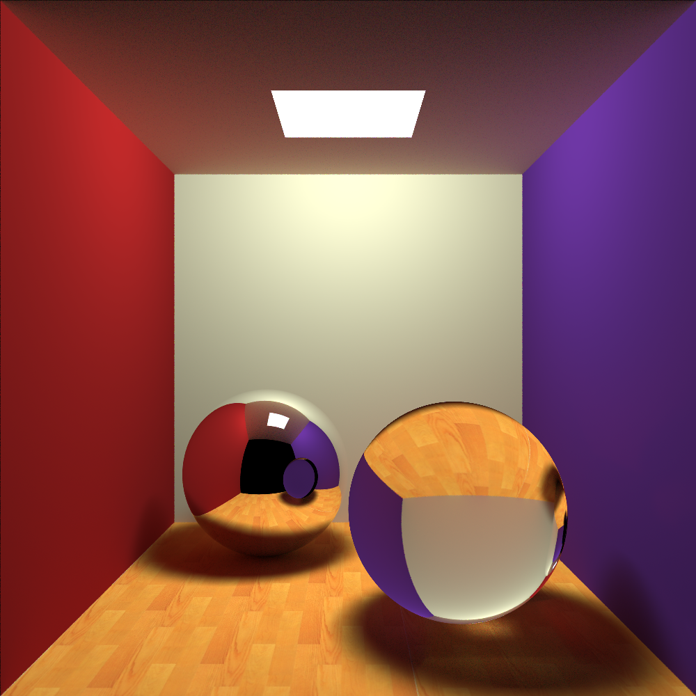
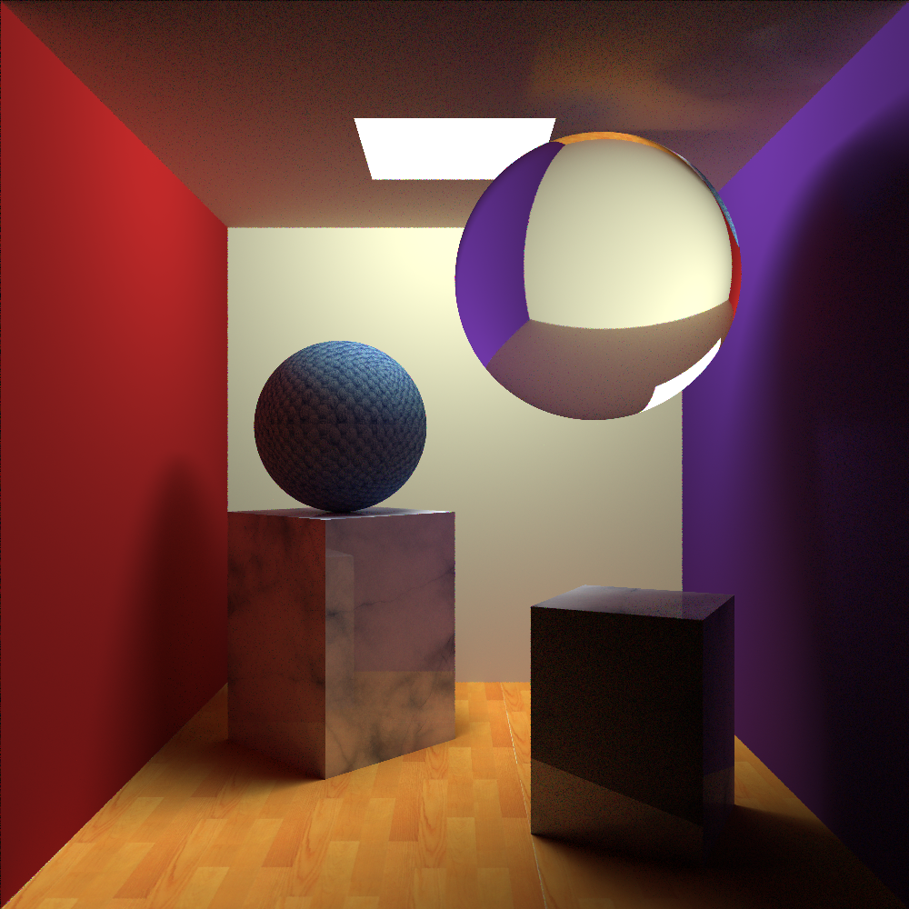
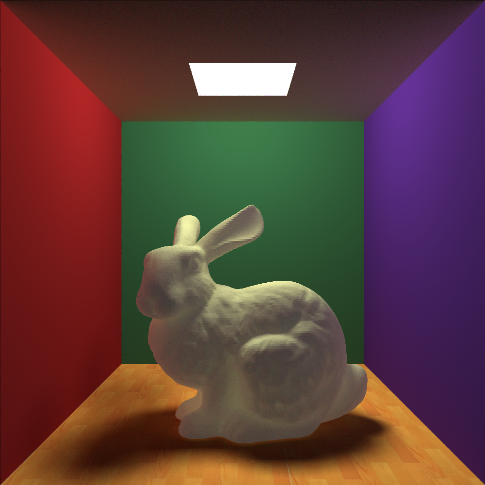
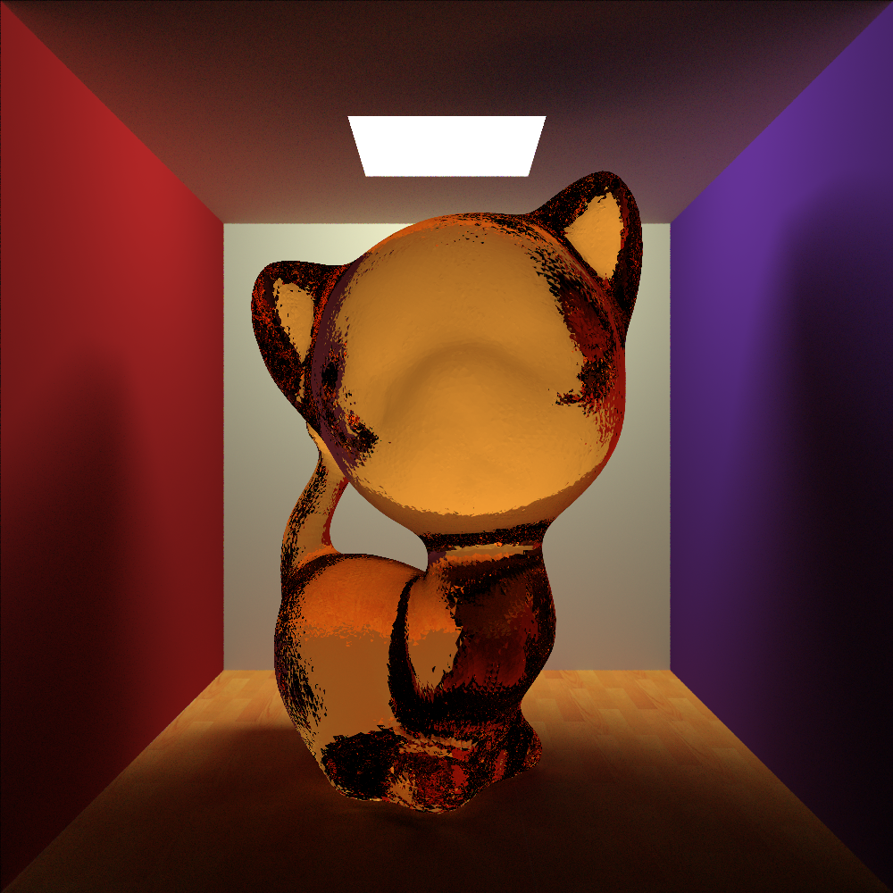
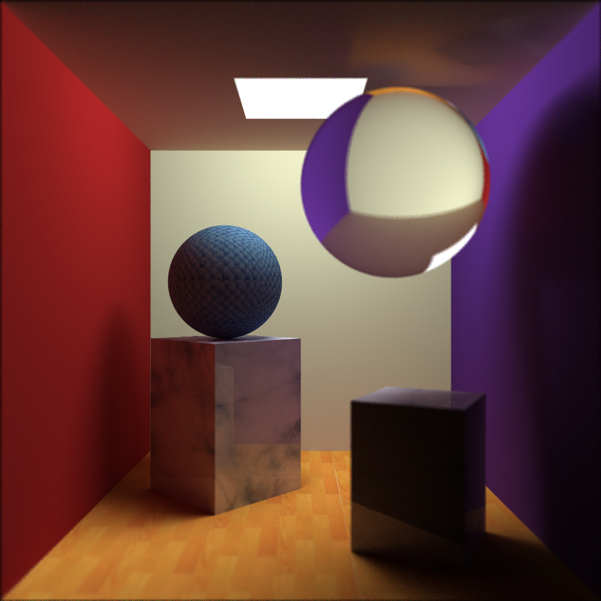

#光线追踪
__徐磊 2013011344__

###摘要
- 使用了蒙特卡洛光线追踪的思想
- 实现了球、矩形，支持贴图
- 参考Whitted模型，实现了漫反射、镜面反射和折射
- 实现了软阴影
- 实现了景深，亦可用于抗锯齿
- 实现了三角面片复杂模型，使用KD树求交加速，支持漫反射、镜面反射、折射，不支持贴图
- [Link to GitHub](https://github.com/leopard1/TraceRay)

###问题描述
在自己设计的三维场景上实现一个简单的光线跟踪模型。

###算法设计
####代码结构
- foundation.h/cpp 实现了一些向量运算和矩阵运算
- core.h/cpp 实现了光线；球、矩形、复杂模型的碰撞、折射、反射等
- camera.h/cpp 实现了照相机的相关功能
- scene.h/cpp 实现了场景和光线追踪的核心算法
- main.cpp 把场景直接写入代码中

由于程序功能比较简单，且对代码的质量没有做很多的要求，所以没有使用复杂的设计。

####功能实现
- __蒙特卡洛光线追踪__ 在常规的光线追踪算法中加入了两次蒙特卡洛。(1) 选择折射、反射或漫反射时，根据材料属性中三部分的比例进行选择，根据赌轮盘的结果对于某一条光线进行递归，在这一过程中材料的属性通过蒙特卡洛的概率体现出来。(2) 对于漫反射，除了与光源计算亮度外，还要随机一条光线，这样就能产生焦散和辉映的效果，为简单起见，两种颜色直接取了max。另外，材料的属性对于三种颜色可能是不同的，算法直接对于三种颜色分别进行了计算。为了提高效率，程序中加入了一些提前终止的阈值。
- __景深__ 确定一个焦平面，那么胶片的某个像素会唯一的对应焦平面上的一个点，在胶片的像素点周围随机采样一些点，和焦平面上的点连接并进行光线追踪，然后对于结果取平均，这样就实现了景深效果。算法错误的选取了均匀分布而不是正态分布，使得景深呈现出了神奇效果。由于是多点取平均，所以当随机撒点的距离很近时，就可以认为是抗锯齿。
- __软阴影__ 在面光源上随机撒点计算阴影。在蒙特卡洛光线追踪中，每次只要随机一个点就可以实现软阴影的效果了。
- __复杂模型__ 复杂模型使用三角面片表示，使用KD树做了求交加速。KD树直接限制了树的高度，且依次选取x, y, z轴的中点来进行切分。(这是检查之后新加的部分)

####测试效果
__1.png__

参考了smallPt的场景，左球为全反射，右球为全折射(n=1.7)，地板为贴图。

__2.png__

加入了更多的物体，为球和立方体都进行了贴图。

__3.png__

bunny的模型（未简化），bunny本身是一个弱光源。

__4.png__

kitten的模型（未简化），kitten是一个折射1.7的橙色玻璃。

__景深效果展示__
<table style="width: 94%;margin-left:auto;margin-right:auto;">
<tr>
<td></td>
<td></td>
</tr>
<tr>
<th>焦点近，小光圈，dd1.png</th>
<th>焦点近，大光圈，d1.png</th>
</tr>
<tr>
<td></td>
<td></td>
</tr>
<tr>
<th>焦点中，小光圈，dd1.png</th>
<th>焦点中，大光圈，d1.png</th>
</tr>
<tr>
<td></td>
<td></td>
</tr>
<tr>
<th>焦点远，小光圈，dd1.png</th>
<th>焦点远，大光圈，d1.png</th>
</tr>
</table>

###总结和感受
通过实现光线追踪算法，更好的理解了关照模型。在脑补各种功能的实现方法时，也锻炼了思维能力。在修补bug、调节参数和控制误差的过程中，增强了编码能力。